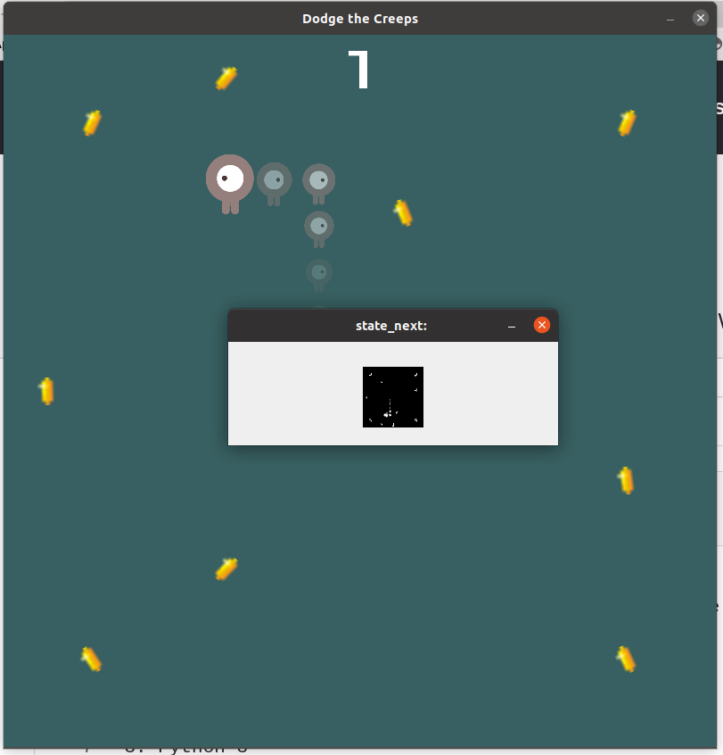
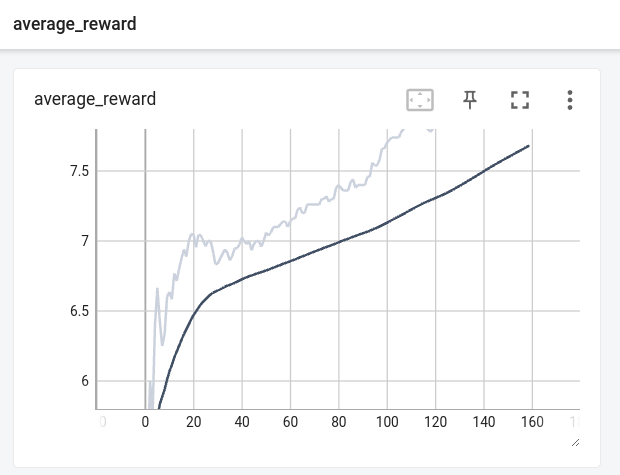
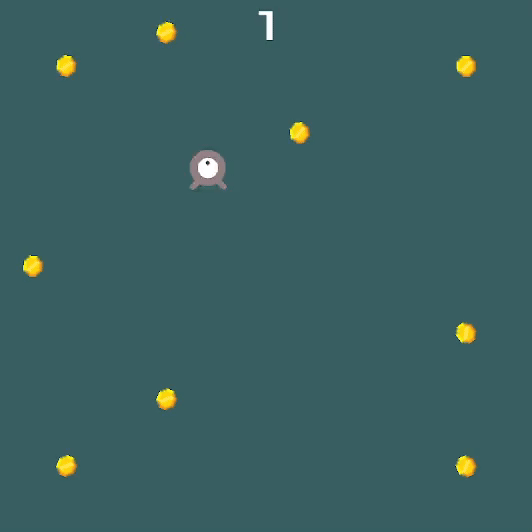

# DogdeCreepTut

This repo is branch of original **[GodotAIGym](https://github.com/lupoglaz/GodotAIGym)** to use the frame screen of 2D game as the input of Neural Network.

## Python Dependencies

1. GodotAIGym
2. Tensorflow
3. Tensorflow Probability
4. OpenCV
5. Gym

## How to run

1. First, you need to install the GodotAIGym module by following [instruction of master branch](https://github.com/lupoglaz/GodotAIGym).

2. Please test the [original agent of master branch](https://github.com/lupoglaz/GodotAIGym/tree/master/Tutorials/InvPendulumTut).

3. After that, you need to create the `DodgeCreep.x86_64` and `DodgeCreep.pck` files into the [dodge_the_creeps](https://github.com/kimbring2/GodotAIGym/tree/uint_type_update/Tutorials/DogdeCreepTut/dodge_the_creeps "dodge_the_creeps") directory. You can find the `project.godot` file inside of there.
   
   

4. If you can install and run the master branch, try to run the example of this repo by using below command. Different from master branch, it use the frame screen image as input. It should start to run the environment and show game screen and gray scale image of that. 
   
   ```
   $ python env_test.py
   ```
   
   

5. If you can see the above image, try to train the agent using the [DodgeCreep_A2C_CNN.ipynb](https://github.com/kimbring2/GodotAIGym/blob/uint_type_update/Tutorials/DogdeCreepTut/DodgeCreep_A2C_CNN.ipynb "DodgeCreep_A2C_CNN.ipynb") file.

6. You can see the training progress by using the Tensorboard under the tensorboard folder.
   
   ```
   $ tensorboard --logdir=./tensorboard
   ```
   
   

7. You can see also the agent start to collect the coin after few hours later.
   
   
