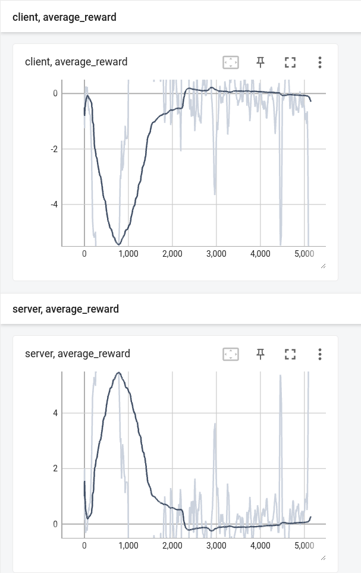

# MultiplayerPongTut

This repo is branch of original **[GodotAIGym](https://github.com/lupoglaz/GodotAIGym)** to use the frame screen of 3D game as the input of Neural Network.

## Python Dependencies

1. GodotAIGym
2. Tensorflow
3. Tensorflow Probability
4. OpenCV
5. Gym

## How to run

1. First, you need to install the GodotAIGym module by following [instruction of master branch](https://github.com/lupoglaz/GodotAIGym).

2. Please test the [original agent of master branch](https://github.com/lupoglaz/GodotAIGym/tree/master/Tutorials/InvPendulumTut).

3. After that, you need to create the `pong_multi.x86_64` and `pong_multi.pck` files into the [multiplayer_pong](https://github.com/kimbring2/GodotAIGym/tree/uint_type_update/Tutorials/MultiplayerPongTut/multiplayer_pong "multiplayer_pong") directory. You can find the `project.godot` file inside of there.
   
   

4. If you can install and run the master branch, try to run the example of this repo by using below command. Different from [DogdeCreepTut](https://github.com/kimbring2/GodotAIGym/tree/uint_type_update/Tutorials/DogdeCreepTut "DogdeCreepTut") and [Basic3DPlatformerTut](https://github.com/kimbring2/GodotAIGym/tree/uint_type_update/Tutorials/Basic3DPlatformerTut "Basic3DPlatformerTut"), it is multi player game which requires two agent than single player game. 
   
   
   
   First, you need to start the server game. You can only see the **Host** button is pushed automaticlaly, not an actual game screen yet.
   
   ```
   $ python env_test_server.py
   ```
   
   
   
   Second, you need to start the client game. You can see the **Join** button is pushed automatically.
   
   ```
   $ python env_test_client.py
   ```
   
   Finally, you can see the actual game playing screen.
   
   

5. If you can see the above images, try to train the agent.
   
   ```
   $ python MultiPlayerPong_A2C_CNN_Server.py
   ```
   
   ```
   $ python MultiPlayerPong_A2C_CNN_Client.py
   ```

6. You can see the training progress by using the Tensorboard under the tensorboard folder.
   
   
   
   ```
   $ tensorboard --logdir=./tensorboard
   ```

7. Trained weight of client agent is saved under the **model** folder periodocayll. We are going to use it to evaluithe performance of model.
   
   

8. To test the trained agent, you also need to run server and client game using the command below. Please load the trained model into client agent.
   
   
   
   ```
   $ python human_play.py
   ```
   
   ```
   $ python ai_play.py
   ```
   
   You are going to play the game thorugh the PyGame window. I was able to confirm that trained model can play the game with people to a certain level.
   
   
